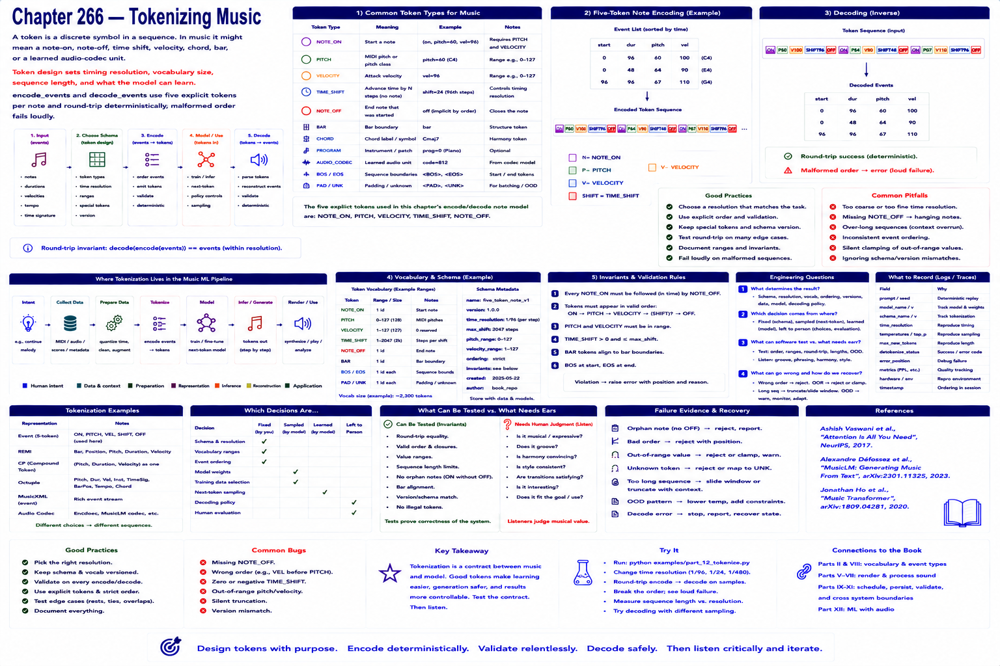

# Chapter 266 — Tokenizing Music

## Model

A token may mean note-on, note-off, time shift, velocity, chord, bar, or a learned audio-codec unit. Token design sets timing resolution and sequence length. `encode_events` and `decode_events` use five explicit tokens per note and round-trip deterministically; malformed order fails loudly.

## Engineering questions

- What inputs, state, parameters, and versions determine the result?
- Which decision is fixed, sampled, learned, or left to a person?
- What invariant can software test, and what judgment requires a listener?
- What failure evidence and recovery control should the interface expose?

## Connection to the book

Parts II and VIII supply musical/event vocabulary; Parts V–VII render and process sound; Parts IX–XI supply scheduling, persistence, validation, and hardware boundaries.

## References

- [Vaswani et al. 2017](../../references/bibliography.md#part-xii-sources); [Copet et al. 2023](../../references/bibliography.md#part-xii-sources); [Ho et al. 2020](../../references/bibliography.md#part-xii-sources).
