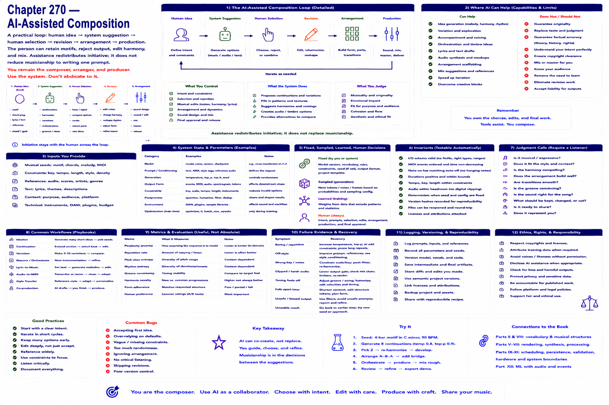

# Chapter 270 — AI-Assisted Composition

## Model

A practical loop is human idea → system suggestion → human selection → revision → arrangement → production. The person can retain motifs, reject output, edit harmony, and mix. Assistance redistributes initiative; it does not reduce musicianship to writing one prompt.

## Engineering questions

- What inputs, state, parameters, and versions determine the result?
- Which decision is fixed, sampled, learned, or left to a person?
- What invariant can software test, and what judgment requires a listener?
- What failure evidence and recovery control should the interface expose?

## Connection to the book

Parts II and VIII supply musical/event vocabulary; Parts V–VII render and process sound; Parts IX–XI supply scheduling, persistence, validation, and hardware boundaries.

## References

- [Vaswani et al. 2017](../../references/bibliography.md#part-xii-sources); [Copet et al. 2023](../../references/bibliography.md#part-xii-sources); [Ho et al. 2020](../../references/bibliography.md#part-xii-sources).
