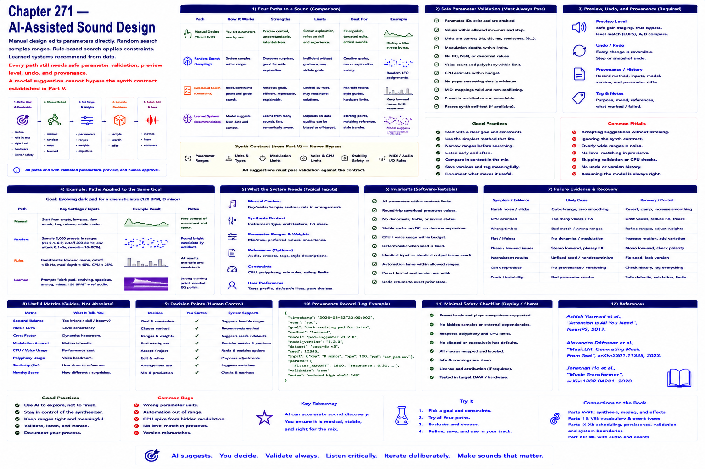

# Chapter 271 — AI-Assisted Sound Design

## Model

Manual design edits parameters directly; random search samples ranges; rule-based search applies constraints; learned systems recommend from data. Every path still needs safe parameter validation, preview level, undo, and provenance. A model suggestion cannot bypass the synth contract established in Part V.

## Engineering questions

- What inputs, state, parameters, and versions determine the result?
- Which decision is fixed, sampled, learned, or left to a person?
- What invariant can software test, and what judgment requires a listener?
- What failure evidence and recovery control should the interface expose?

## Connection to the book

Parts II and VIII supply musical/event vocabulary; Parts V–VII render and process sound; Parts IX–XI supply scheduling, persistence, validation, and hardware boundaries.

## References

- [Vaswani et al. 2017](../../references/bibliography.md#part-xii-sources); [Copet et al. 2023](../../references/bibliography.md#part-xii-sources); [Ho et al. 2020](../../references/bibliography.md#part-xii-sources).
