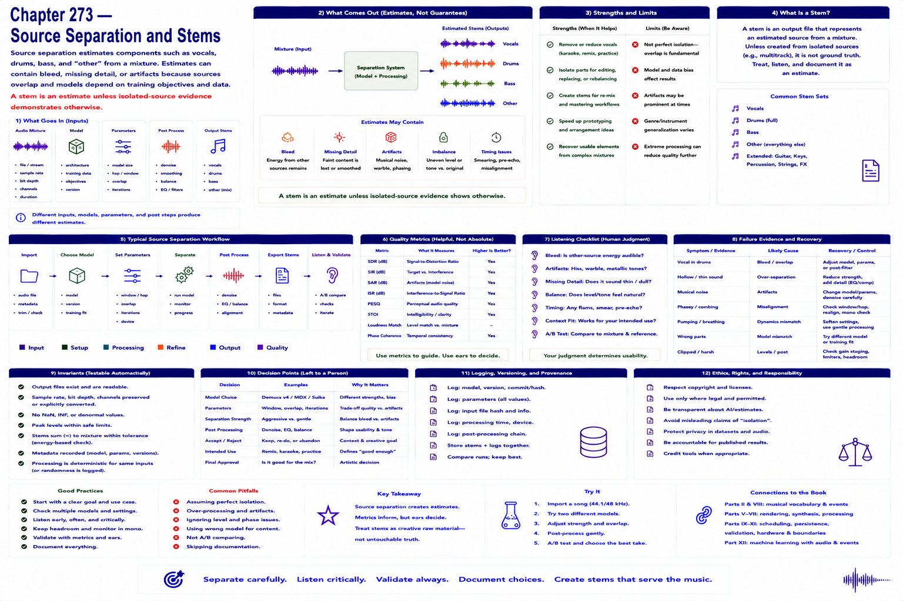

# Chapter 273 — Source Separation and Stems

## Model

Source separation estimates components such as vocals, drums, bass, and “other” from a mixture. Estimates can contain bleed, missing detail, or artifacts because sources overlap and models depend on training objectives and data. A stem is an estimate unless isolated-source evidence demonstrates otherwise.

## Engineering questions

- What inputs, state, parameters, and versions determine the result?
- Which decision is fixed, sampled, learned, or left to a person?
- What invariant can software test, and what judgment requires a listener?
- What failure evidence and recovery control should the interface expose?

## Connection to the book

Parts II and VIII supply musical/event vocabulary; Parts V–VII render and process sound; Parts IX–XI supply scheduling, persistence, validation, and hardware boundaries.

## References

- [Vaswani et al. 2017](../../references/bibliography.md#part-xii-sources); [Copet et al. 2023](../../references/bibliography.md#part-xii-sources); [Ho et al. 2020](../../references/bibliography.md#part-xii-sources).
