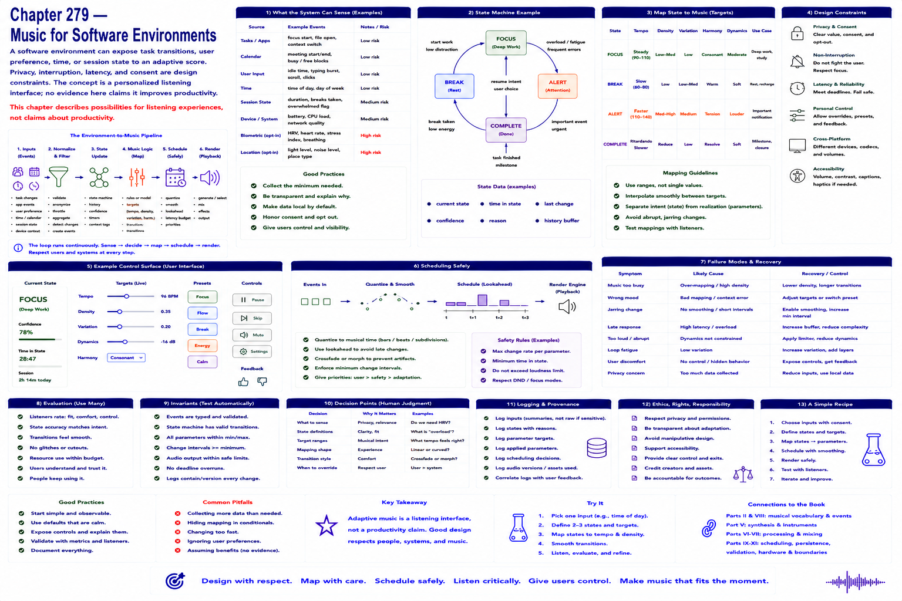

# Chapter 279 — Music for Software Environments

## Model

A software environment could expose task transitions, user preference, time, or session state to an adaptive score. Privacy, interruption, latency, and consent are design constraints. The concept is a personalized listening interface; no evidence here claims it improves productivity.

## Engineering questions

- What inputs, state, parameters, and versions determine the result?
- Which decision is fixed, sampled, learned, or left to a person?
- What invariant can software test, and what judgment requires a listener?
- What failure evidence and recovery control should the interface expose?

## Connection to the book

Parts II and VIII supply musical/event vocabulary; Parts V–VII render and process sound; Parts IX–XI supply scheduling, persistence, validation, and hardware boundaries.

## References

- [Collins 2008](../../references/bibliography.md#part-xii-sources); [Amershi et al. 2019](../../references/bibliography.md#part-xii-sources).
