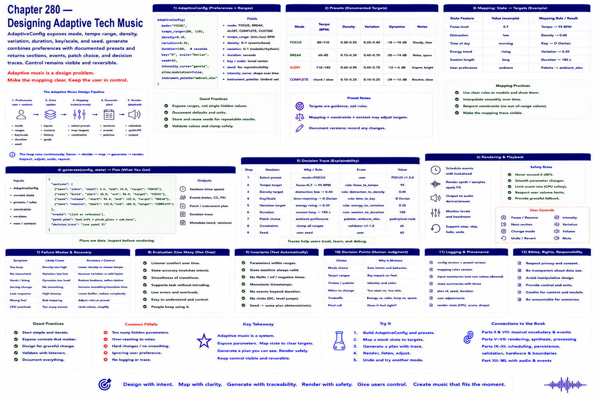

# Chapter 280 — Designing Adaptive Tech Music

## Model

`AdaptiveConfig` exposes mode, tempo range, density, variation, duration, key/scale, and seed. `generate` combines preferences with documented presets and returns sections, events, patch choice, and decision traces. Control remains visible and reversible.

## Engineering questions

- What inputs, state, parameters, and versions determine the result?
- Which decision is fixed, sampled, learned, or left to a person?
- What invariant can software test, and what judgment requires a listener?
- What failure evidence and recovery control should the interface expose?

## Connection to the book

Parts II and VIII supply musical/event vocabulary; Parts V–VII render and process sound; Parts IX–XI supply scheduling, persistence, validation, and hardware boundaries.

## References

- [Collins 2008](../../references/bibliography.md#part-xii-sources); [Amershi et al. 2019](../../references/bibliography.md#part-xii-sources).
