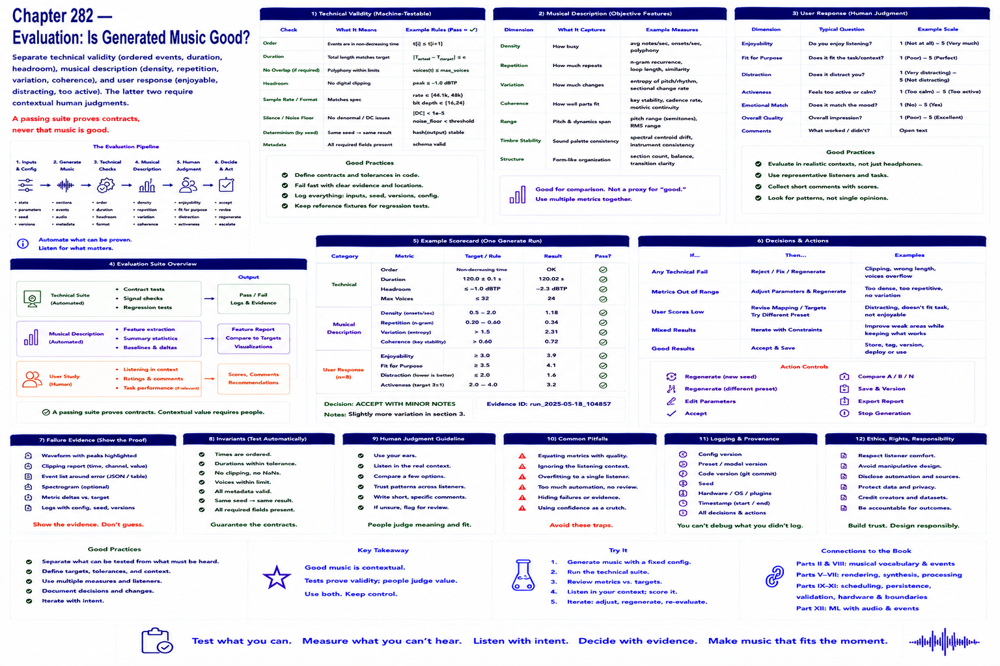

# Chapter 282 — Evaluation: Is Generated Music Good?

## Model

Separate **technical** validity (ordered events, duration, headroom), **musical description** (density, repetition, variation, coherence), and **user response** (enjoyable, distracting, too active). The latter two require contextual human judgments. A passing suite proves contracts, never that music is good.

## Engineering questions

- What inputs, state, parameters, and versions determine the result?
- Which decision is fixed, sampled, learned, or left to a person?
- What invariant can software test, and what judgment requires a listener?
- What failure evidence and recovery control should the interface expose?

## Connection to the book

Parts II and VIII supply musical/event vocabulary; Parts V–VII render and process sound; Parts IX–XI supply scheduling, persistence, validation, and hardware boundaries.

## References

- [Collins 2008](../../references/bibliography.md#part-xii-sources); [Amershi et al. 2019](../../references/bibliography.md#part-xii-sources).
