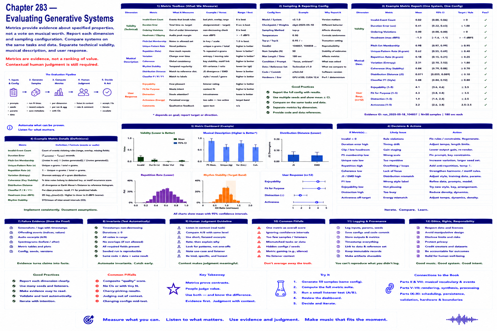

# Chapter 283 — Evaluating Generative Systems

## Model

Useful metrics include invalid-event count, duration error, pitch-set membership, unique-pattern rate, repetition, distribution distance, and classification precision/recall. Report each dimension and sampling configuration. Metrics are evidence about specified properties, not a composite ranking of musical value.

## Engineering questions

- What inputs, state, parameters, and versions determine the result?
- Which decision is fixed, sampled, learned, or left to a person?
- What invariant can software test, and what judgment requires a listener?
- What failure evidence and recovery control should the interface expose?

## Connection to the book

Parts II and VIII supply musical/event vocabulary; Parts V–VII render and process sound; Parts IX–XI supply scheduling, persistence, validation, and hardware boundaries.

## References

- [Collins 2008](../../references/bibliography.md#part-xii-sources); [Amershi et al. 2019](../../references/bibliography.md#part-xii-sources).
