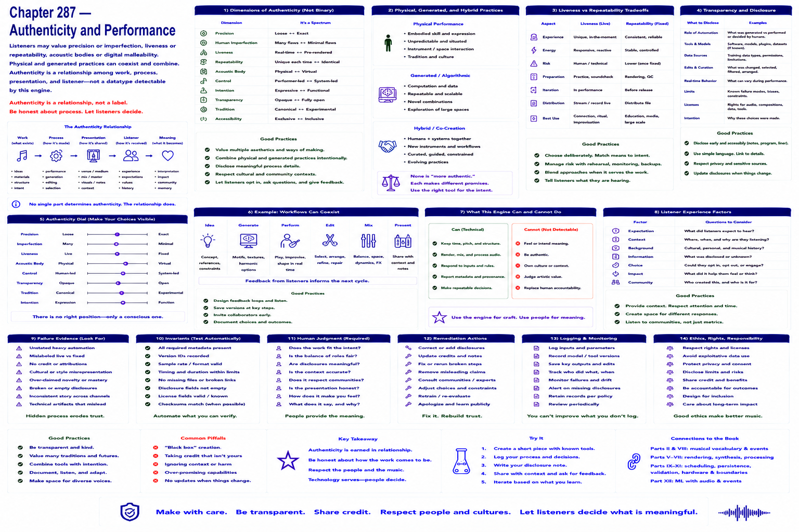

# Chapter 287 — Authenticity and Performance

## Model

Listeners may value precision or imperfection, liveness or repeatability, acoustic bodies or digital malleability. Physical and generated practices can coexist and combine. Authenticity is a relationship among work, process, presentation, and listener—not a datatype detectable by this engine.

## Engineering questions

- What inputs, state, parameters, and versions determine the result?
- Which decision is fixed, sampled, learned, or left to a person?
- What invariant can software test, and what judgment requires a listener?
- What failure evidence and recovery control should the interface expose?

## Connection to the book

Parts II and VIII supply musical/event vocabulary; Parts V–VII render and process sound; Parts IX–XI supply scheduling, persistence, validation, and hardware boundaries.

## References

- [U.S. Copyright Office 2025](../../references/bibliography.md#part-xii-sources); [NIST AI RMF](../../references/bibliography.md#part-xii-sources); [Amershi et al. 2019](../../references/bibliography.md#part-xii-sources).
