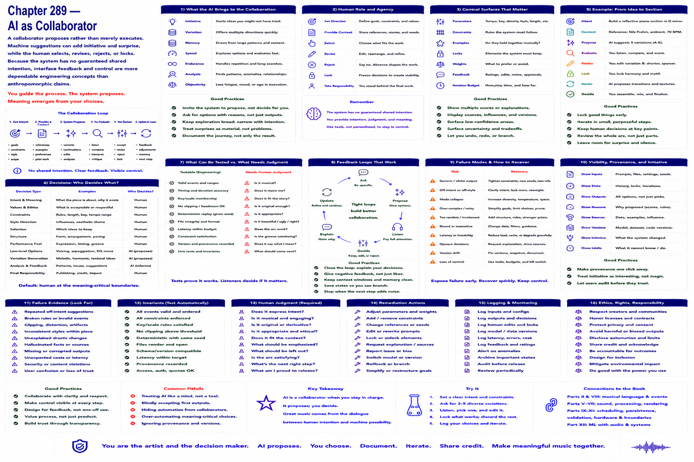

# Chapter 289 — AI as Collaborator

## Model

A collaborator proposes rather than merely executes. Machine suggestions can add initiative and surprise, while the human selects, revises, rejects, or locks. Because the system has no guaranteed shared intention, interface feedback and control are more dependable engineering concepts than anthropomorphic claims.

## Engineering questions

- What inputs, state, parameters, and versions determine the result?
- Which decision is fixed, sampled, learned, or left to a person?
- What invariant can software test, and what judgment requires a listener?
- What failure evidence and recovery control should the interface expose?

## Connection to the book

Parts II and VIII supply musical/event vocabulary; Parts V–VII render and process sound; Parts IX–XI supply scheduling, persistence, validation, and hardware boundaries.

## References

- [U.S. Copyright Office 2025](../../references/bibliography.md#part-xii-sources); [NIST AI RMF](../../references/bibliography.md#part-xii-sources); [Amershi et al. 2019](../../references/bibliography.md#part-xii-sources).
