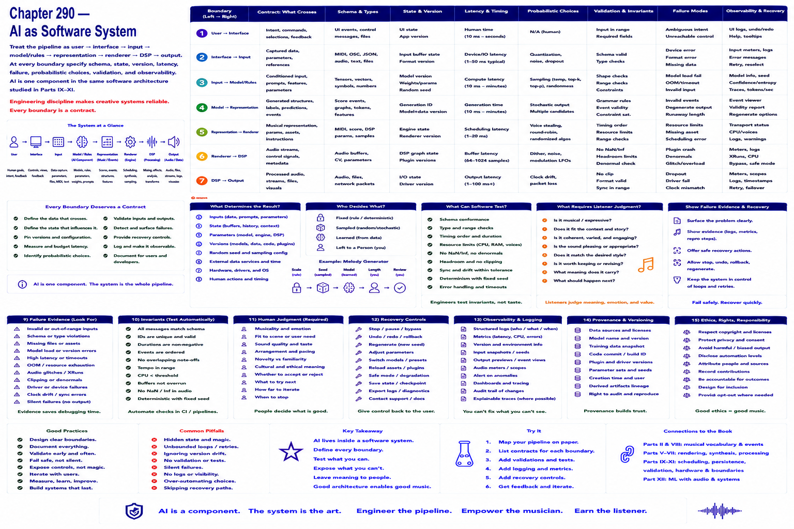

# Chapter 290 — AI as Software System

## Model

Treat the pipeline as `user → interface → input → model/rules → representation → renderer → DSP → output`. At every boundary specify schema, state, version, latency, failure, probabilistic choices, validation, and observability. AI is one component in the same software architecture studied in Parts IX–XI.

## Engineering questions

- What inputs, state, parameters, and versions determine the result?
- Which decision is fixed, sampled, learned, or left to a person?
- What invariant can software test, and what judgment requires a listener?
- What failure evidence and recovery control should the interface expose?

## Connection to the book

Parts II and VIII supply musical/event vocabulary; Parts V–VII render and process sound; Parts IX–XI supply scheduling, persistence, validation, and hardware boundaries.

## References

- [U.S. Copyright Office 2025](../../references/bibliography.md#part-xii-sources); [NIST AI RMF](../../references/bibliography.md#part-xii-sources); [Amershi et al. 2019](../../references/bibliography.md#part-xii-sources).
