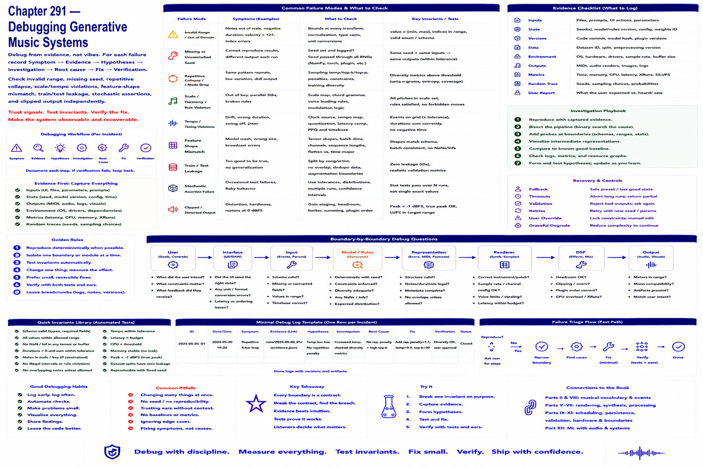

# Chapter 291 — Debugging Generative Music Systems

## Model

Debug from evidence, not vibes. For each failure record **Symptom → Evidence → Hypotheses → Investigation → Root cause → Fix → Verification**. Check invalid range, missing seed, repetitive collapse, scale/tempo violations, feature-shape mismatch, train/test leakage, stochastic assertions, and clipped output independently.

## Engineering questions

- What inputs, state, parameters, and versions determine the result?
- Which decision is fixed, sampled, learned, or left to a person?
- What invariant can software test, and what judgment requires a listener?
- What failure evidence and recovery control should the interface expose?

## Connection to the book

Parts II and VIII supply musical/event vocabulary; Parts V–VII render and process sound; Parts IX–XI supply scheduling, persistence, validation, and hardware boundaries.

## References

- [U.S. Copyright Office 2025](../../references/bibliography.md#part-xii-sources); [NIST AI RMF](../../references/bibliography.md#part-xii-sources); [Amershi et al. 2019](../../references/bibliography.md#part-xii-sources).
