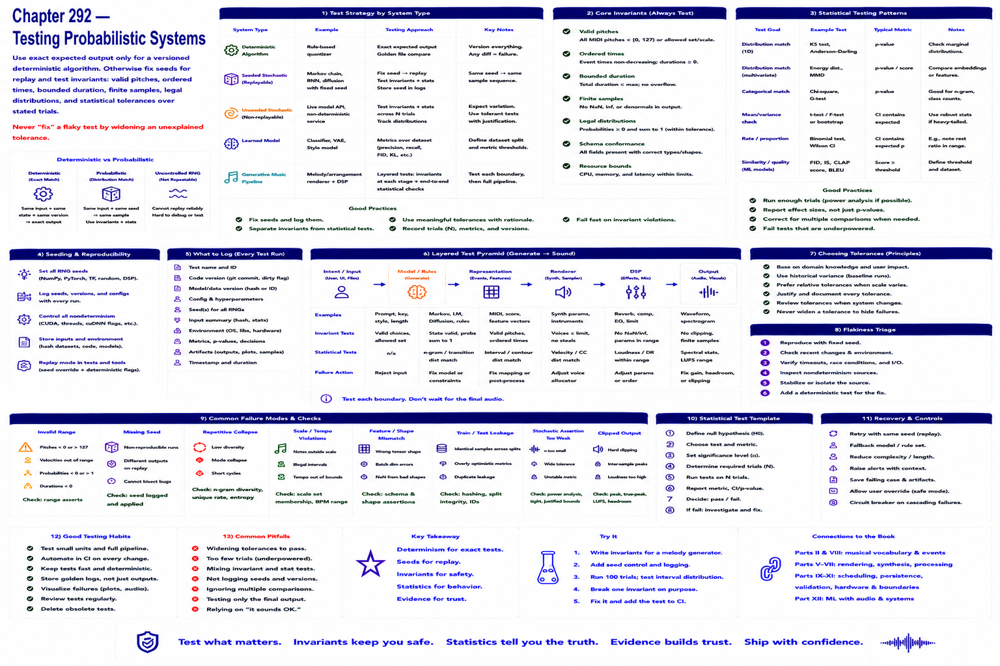

# Chapter 292 — Testing Probabilistic Systems

## Model

Use exact expected output only for a versioned deterministic algorithm. Otherwise fix seeds for replay and test invariants: valid pitches, ordered times, bounded duration, finite samples, legal distributions, and statistical tolerances over stated trials. Never “fix” a flaky test by widening an unexplained tolerance.

## Engineering questions

- What inputs, state, parameters, and versions determine the result?
- Which decision is fixed, sampled, learned, or left to a person?
- What invariant can software test, and what judgment requires a listener?
- What failure evidence and recovery control should the interface expose?

## Connection to the book

Parts II and VIII supply musical/event vocabulary; Parts V–VII render and process sound; Parts IX–XI supply scheduling, persistence, validation, and hardware boundaries.

## References

- [U.S. Copyright Office 2025](../../references/bibliography.md#part-xii-sources); [NIST AI RMF](../../references/bibliography.md#part-xii-sources); [Amershi et al. 2019](../../references/bibliography.md#part-xii-sources).
