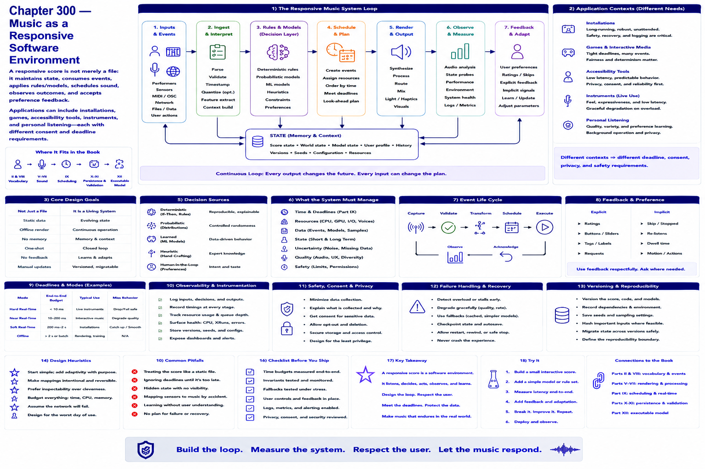

# Chapter 300 — Music as a Responsive Software Environment

## Model

A responsive score is not merely a file: it maintains state, consumes events, applies rules/models, schedules sound, observes outcomes, and accepts preference feedback. Applications can include installations, games, accessibility tools, instruments, and personal listening—each with different consent and deadline requirements.

## Engineering questions

- What inputs, state, parameters, and versions determine the result?
- Which decision is fixed, sampled, learned, or left to a person?
- What invariant can software test, and what judgment requires a listener?
- What failure evidence and recovery control should the interface expose?

## Connection to the book

Parts II and VIII supply musical/event vocabulary; Parts V–VII render and process sound; Parts IX–XI supply scheduling, persistence, validation, and hardware boundaries.

## References

- [Part XII executable model](../../src/tech_music/generative.py); [Roads 1996](../../references/bibliography.md#part-xii-sources).
