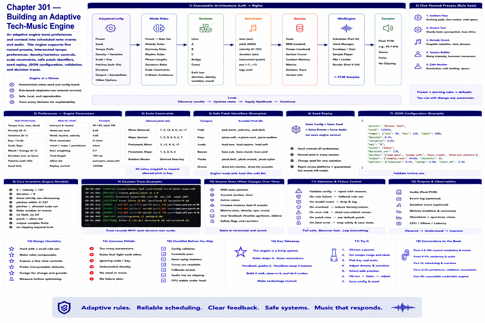

# Chapter 301 — Building an Adaptive Tech-Music Engine

## Model

The executable architecture is `AdaptiveConfig → mode rules → sections → NoteEvent → Session → MiniEngine → samples`. It supports five named presets, intersected tempo preferences, density/variation controls, minor/major/pentatonic constraints, safe patch identifiers, seed replay, JSON configuration, validation, and decision traces.

## Engineering questions

- What inputs, state, parameters, and versions determine the result?
- Which decision is fixed, sampled, learned, or left to a person?
- What invariant can software test, and what judgment requires a listener?
- What failure evidence and recovery control should the interface expose?

## Connection to the book

Parts II and VIII supply musical/event vocabulary; Parts V–VII render and process sound; Parts IX–XI supply scheduling, persistence, validation, and hardware boundaries.

## References

- [Part XII executable model](../../src/tech_music/generative.py); [Roads 1996](../../references/bibliography.md#part-xii-sources).
