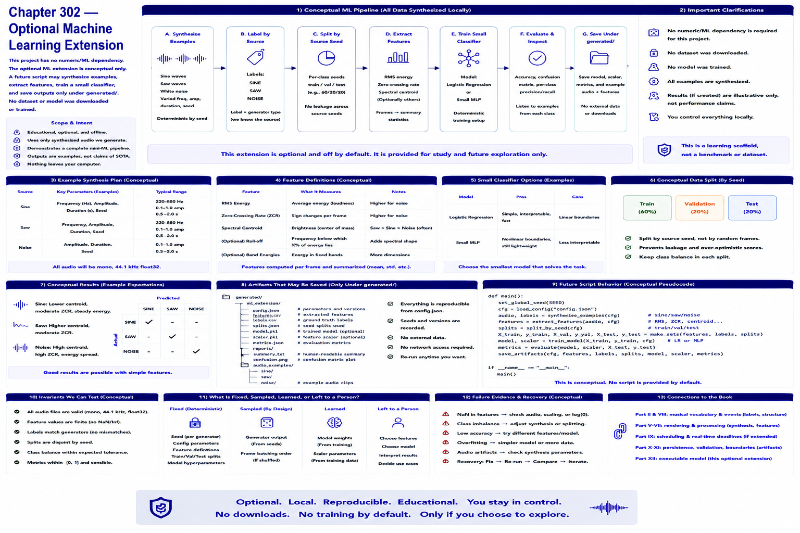

# Chapter 302 — Optional Machine Learning Extension

## Model

The optional ML extension is intentionally conceptual because the project has no numeric/ML dependency. A future script may synthesize sine/saw/noise examples, split by source seed, extract RMS/ZCR/centroid, train a small classifier, and save outputs only under `generated/`. No dataset or model was downloaded or trained.

## Engineering questions

- What inputs, state, parameters, and versions determine the result?
- Which decision is fixed, sampled, learned, or left to a person?
- What invariant can software test, and what judgment requires a listener?
- What failure evidence and recovery control should the interface expose?

## Connection to the book

Parts II and VIII supply musical/event vocabulary; Parts V–VII render and process sound; Parts IX–XI supply scheduling, persistence, validation, and hardware boundaries.

## References

- [Part XII executable model](../../src/tech_music/generative.py); [Roads 1996](../../references/bibliography.md#part-xii-sources).
