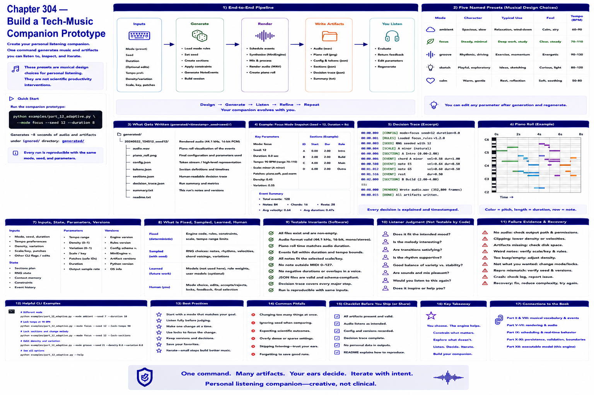

# Chapter 304 — Build a Tech-Music Companion Prototype

## Model

The companion prototype is `python examples/part_12_adaptive.py --mode focus --seed 12 --duration 8`. It writes audio, piano roll, configuration/tokens, sections, and decision trace beneath ignored `generated/`. The presets are musical design choices for personal listening, not scientific productivity interventions.

## Engineering questions

- What inputs, state, parameters, and versions determine the result?
- Which decision is fixed, sampled, learned, or left to a person?
- What invariant can software test, and what judgment requires a listener?
- What failure evidence and recovery control should the interface expose?

## Connection to the book

Parts II and VIII supply musical/event vocabulary; Parts V–VII render and process sound; Parts IX–XI supply scheduling, persistence, validation, and hardware boundaries.

## References

- [Part XII executable model](../../src/tech_music/generative.py); [Roads 1996](../../references/bibliography.md#part-xii-sources).
