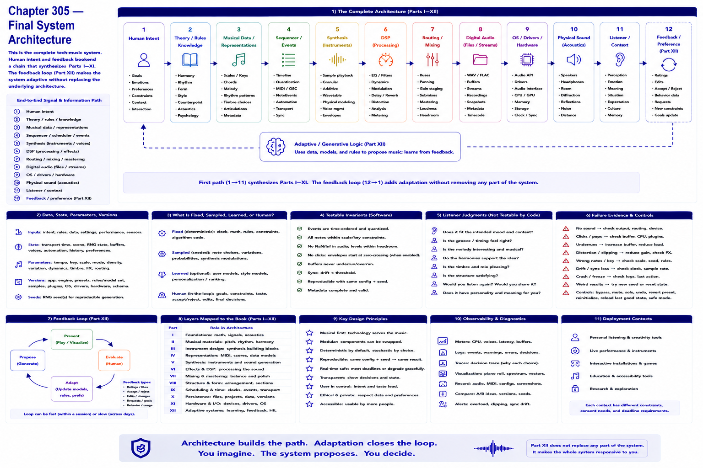

# Chapter 305 — Final System Architecture



## Model

```text
Human intent → theory/rules → musical data → sequencer/events → synthesis
→ DSP → routing/mixing → digital audio → OS/hardware → physical sound → listener

      ┌──── data / model / rules ────┐
      ↓                              │
Human → adaptive/generative logic → music system
  ↑                                  │
  └────── feedback / preference ─────┘
```
The first path synthesizes Parts I–XI; the feedback loop adds Part XII without replacing the underlying system.

## Engineering questions

- What inputs, state, parameters, and versions determine the result?
- Which decision is fixed, sampled, learned, or left to a person?
- What invariant can software test, and what judgment requires a listener?
- What failure evidence and recovery control should the interface expose?

## Connection to the book

Parts II and VIII supply musical/event vocabulary; Parts V–VII render and process sound; Parts IX–XI supply scheduling, persistence, validation, and hardware boundaries.

## References

- [Part XII executable model](../../src/tech_music/generative.py); [Roads 1996](../../references/bibliography.md#part-xii-sources).
