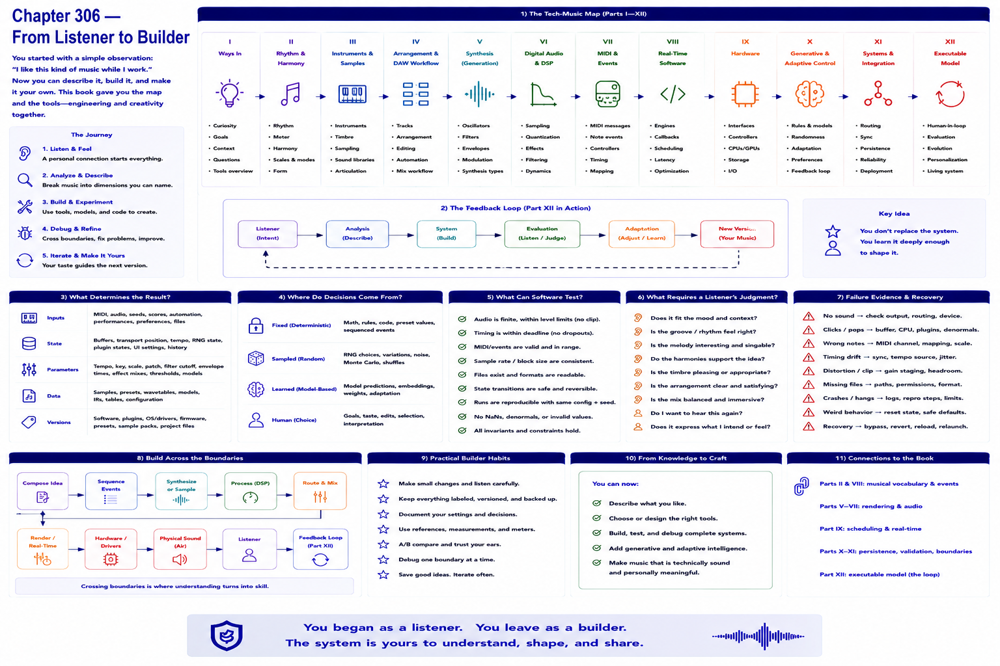

# Chapter 306 — From Listener to Builder

## Model

The opening observation—“I like this kind of music while I work”—can now be decomposed without diminishing it. The reader can describe rhythm/harmony, arrangement/DAW workflow, synthesis/samples, digital audio/DSP, MIDI/events, real-time software, hardware, and generative/adaptive control, then build and debug across those boundaries.

## Engineering questions

- What inputs, state, parameters, and versions determine the result?
- Which decision is fixed, sampled, learned, or left to a person?
- What invariant can software test, and what judgment requires a listener?
- What failure evidence and recovery control should the interface expose?

## Connection to the book

Parts II and VIII supply musical/event vocabulary; Parts V–VII render and process sound; Parts IX–XI supply scheduling, persistence, validation, and hardware boundaries.

## References

- [Part XII executable model](../../src/tech_music/generative.py); [Roads 1996](../../references/bibliography.md#part-xii-sources).
